# 🚗 Legacy Carwash

Una aplicación moderna y eficiente para la gestión de citas y servicios de lavado de autos. Diseñada con Jetpack Compose y Material You, Legacy Carwash ofrece una experiencia visualmente atractiva, fácil de usar y centrada en el cliente.

---

## 🧾 Tabla de Contenido

* [🔐 Autenticación](#-autenticación)
* [🏠 Inicio](#-inicio)
* [🧼 Servicios](#-servicios)
* [📆 Agendar Cita y Calendario](#-agendar-cita-y-calendario)
* [🚘 Mis Vehículos](#-mis-vehículos)
* [👤 Perfil y Configuración](#-perfil-y-configuración)
* [📝 Editar Perfil](#-editar-perfil)
* [📚 Historial de Citas](#-historial-de-citas)
* [🎉 Promociones](#-promociones)
* [📸 Galería](#-galería)
* [🛠️ Tecnologías Usadas](#-tecnologías-usadas)

---

## 🔐 Autenticación

Pantallas de login y registro modernas y responsivas.

| Login              | Registro              |
| ------------------ | --------------------- |
| 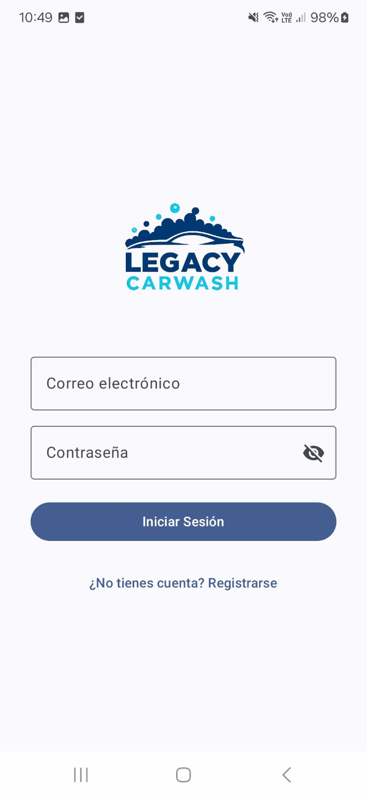 |  |

---

## 🏠 Inicio

Muestra resumen de promociones, servicios rápidos y navegación destacada.

| Sin citas               | Con citas          |
| ----------------------- | ------------------ |
| 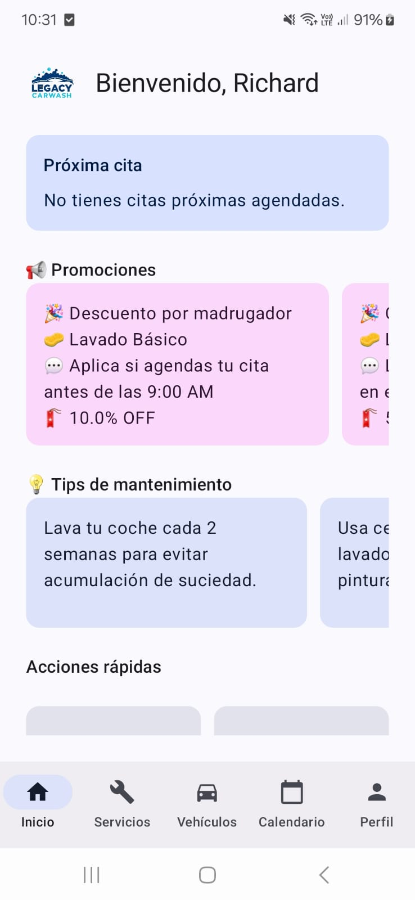 | 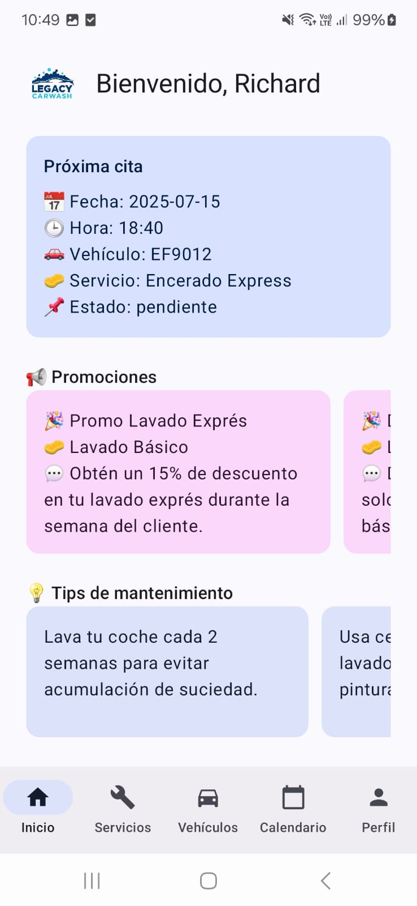  |
| 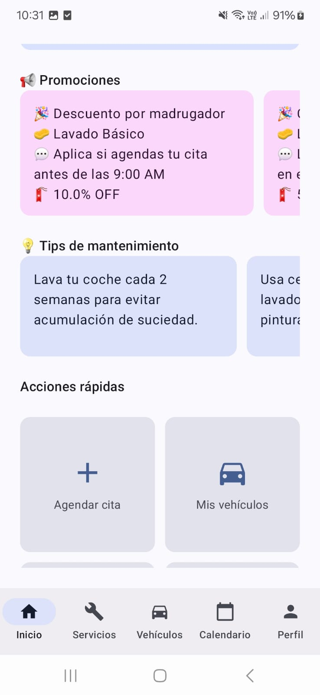      | 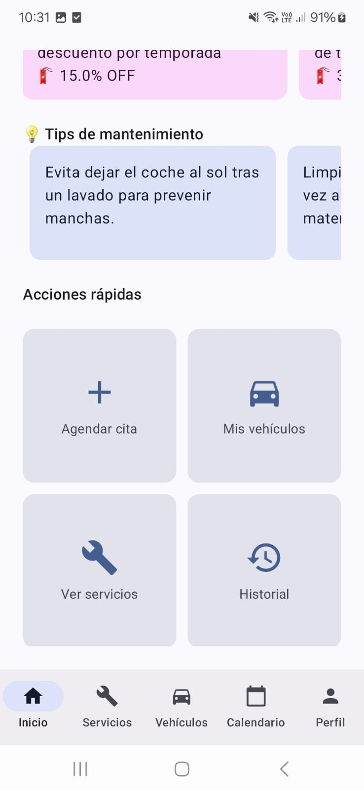 |

---

## 🧼 Servicios

Consulta los servicios disponibles y sus detalles.

  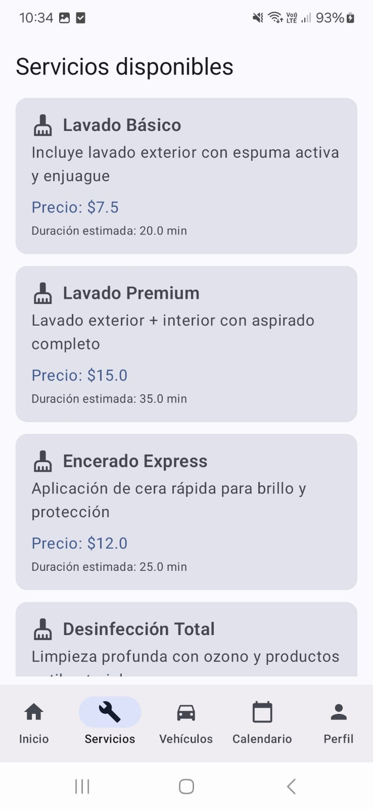

---

## 📆 Agendar Cita y Calendario

Planifica tu lavado o mantenimiento desde una interfaz fluida.

| Agendar                         | Calendario             |
| ------------------------------- | ---------------------- |
| 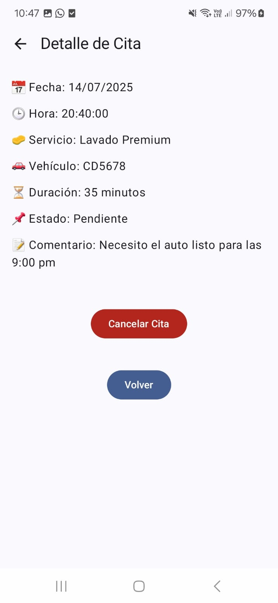  | 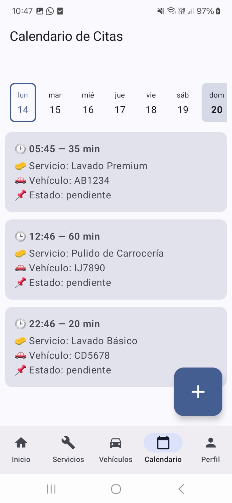  |
| 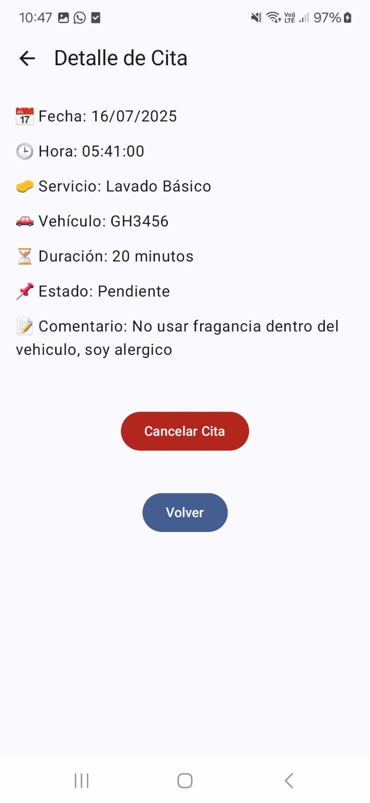 | 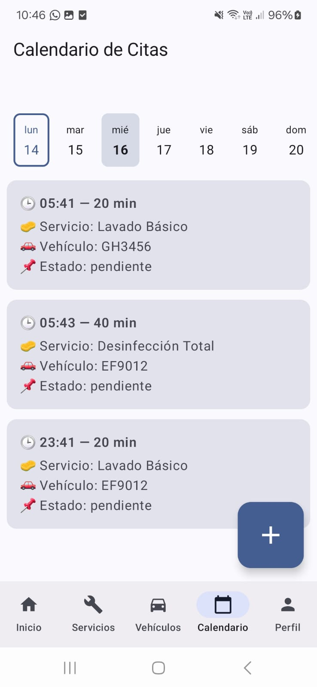 |

---

## 🚘 Mis Vehículos

Gestiona los vehículos registrados en tu cuenta.

  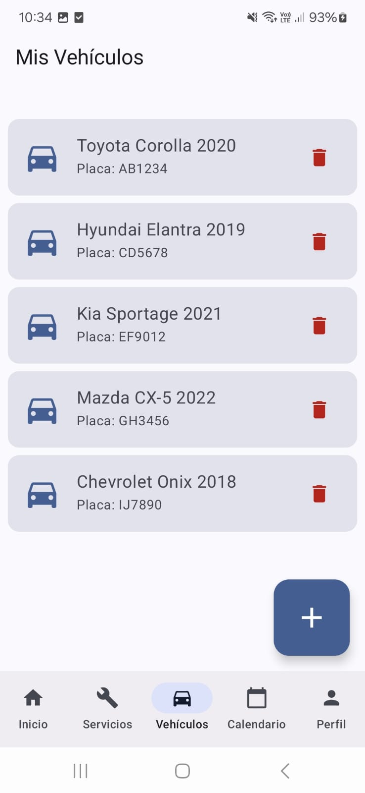

---

## 👤 Perfil y Configuración

Visualiza tus datos, accede a tus vehículos, historial y más.

  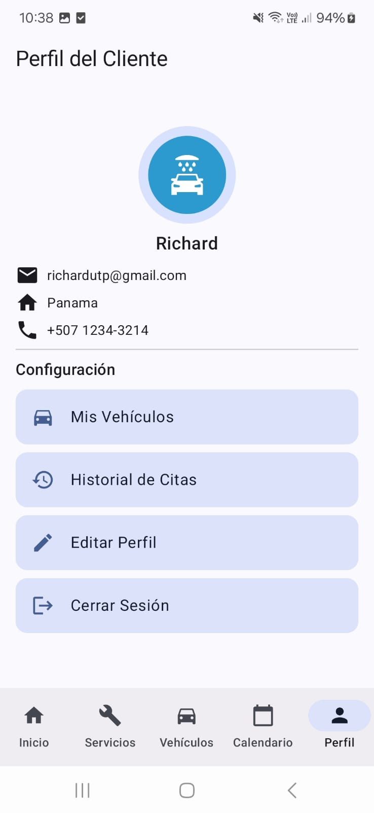

---

## 📝 Editar Perfil

Modifica tu nombre, correo y teléfono fácilmente.

  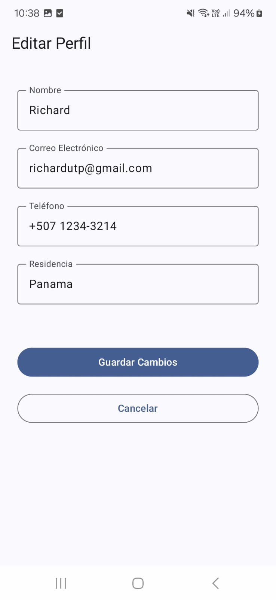

---

## 📚 Historial de Citas

Consulta tus citas anteriores y su estado.

| Lista                | Detalle               |
| -------------------- | --------------------- |
| 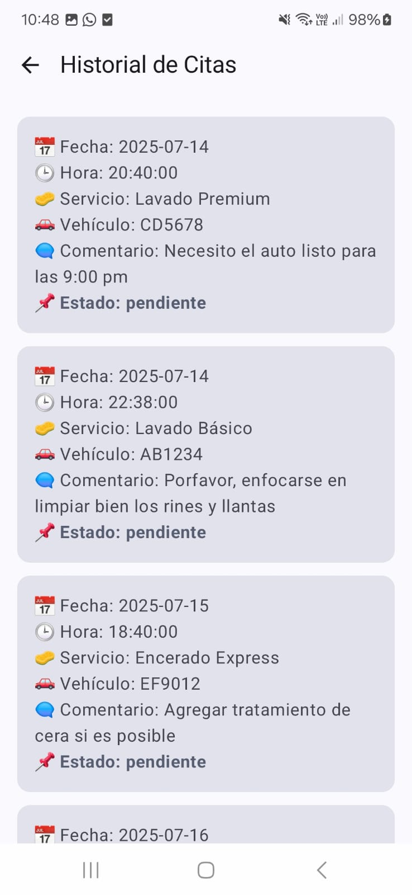 |  |

---

## 🎉 Promociones

Visualiza las promociones disponibles y detalles por servicio.

  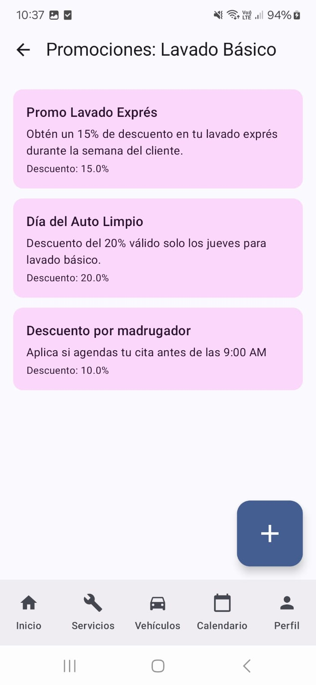

---

## 📸 Galería

Para ver cómo se ve la app en acción.

Puedes explorar todas las capturas en la carpeta /img.

---

## 🛠️ Tecnologías Usadas

* Kotlin + Jetpack Compose  
* Material You Design  
* MVVM (Model - View - ViewModel) + StateFlow  
* Retrofit para consumo de API  
* Navegación con Jetpack Navigation  

